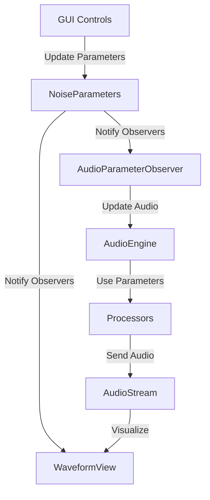

# GUI Development Notes

## Current State of Parameter System

### Current GUI Parameter Components

1. **App/gui/parameters/parameter_registry.py**:
   - Defines a GUI-specific `ParameterRegistry` class that manages parameter definitions
   - Creates a `ParameterDefinition` dataclass to store parameter metadata
   - Provides methods to register and retrieve parameter definitions
   - This is separate from the core parameter registry and is specifically designed for GUI use

2. **App/gui/parameters/parameter_definitions.py**:
   - Creates a global GUI parameter registry instance
   - Imports and registers common parameters from the core system
   - Provides a getter function to access the registry
   - Acts as a bridge between core parameters and GUI components

3. **App/gui/parameters/validation.py**:
   - Simply imports validation functions from the core system
   - Doesn't implement any GUI-specific validation logic
   - Reuses the core validation system for consistency

### Current Issues with Parameter Management

#### 1. Parameter System Architecture Issues

- **Disconnected Parameter Flow**: The parameter system has been made more modular, but the connections between components are broken. The GUI doesn't properly update the NoiseParameters object, and changes don't propagate through the system.

- **Inconsistent Parameter Access**: Different parts of the code access parameters in different ways:
  - Direct dictionary access
  - Through get_parameter() methods
  - Via the parameter registry
  - Through processor-specific parameter definitions

- **Overly Complex Structure**: The parameter system has multiple layers (ParameterRegistry, ParameterDefinitionBuilder, NoiseParameters) that make it hard to follow the flow of parameter updates.

- **Circular Dependencies**: The parameter_system.py imports from GUI modules, creating circular dependencies that complicate the architecture.

#### 2. GUI-Specific Issues

- **Missing Event Handlers**: The GUI controls in NoiseControlsWidget don't have event handlers to update parameters when users interact with them.

- **Broken Parameter Display**: When switching between processors, the GUI doesn't properly update to show the correct parameters for the selected processor.

- **Incomplete Parameter Passing**: The GUI doesn't correctly pass processor type information to the parameter system when switching processors.

#### 3. Integration Issues

- **Processor Selection Not Connected**: When selecting different generators or filters in the GUI, the audio engine isn't updated to use the selected processors.

- **Parameter Validation Duplication**: Parameter validation is performed in multiple places (NoiseParameters, AudioProcessorFactory, ParameterRegistry) leading to potential inconsistencies.

- **Duplicate Parameter Registries**: There's duplication between core and GUI parameter registries rather than a unified system.

## Relationship to Development Plan

According to the development notes, the system is in the middle of a refactoring process:

1. **Phase 1 (Parameter System Overhaul)** has been completed:
   - Dictionary-based parameters are implemented
   - Parameter registry is in place
   - Validation system is working

2. **Phase 2 (Dynamic Component System)** is partially implemented:
   - Component factories are in place
   - The AudioProcessorFactory handles parameter validation and processor instantiation

However, the current implementation doesn't fully follow the planned architecture:
- The GUI parameter system is partially separate from the core system, rather than being a unified flow
- There's duplication between core and GUI parameter registries
- The parameter_system.py imports from GUI modules, creating a circular dependency

## Proposed Solution

### Simplified Parameter Flow Diagram

### Key Improvements

1. **Unified Parameter Flow**: All parameter changes flow through NoiseParameters
2. **Clear Observer Pattern**: Components subscribe to parameter changes
3. **Direct Audio Feedback**: Audio changes are visualized in real-time
4. **Simplified Architecture**: Reduced number of parameter access points

## Detailed Implementation Plan

### Phase 1: Fix Parameter Validation (Completed)
- [x] Update validation.py to handle different ParameterRange implementations
- [x] Make ParameterRange properly callable
- [x] Ensure consistent validation across core and GUI components

### Phase 2: Resolve Circular Dependencies
1. **Refactor Parameter System**:
   - Move all parameter system code to core
   - Remove GUI imports from core modules
   - Create proper interfaces for parameter access

2. **Unify Parameter Registries**:
   - Consolidate core and GUI parameter registries
   - Create a single source of truth for parameter definitions
   - Implement proper inheritance hierarchy

### Phase 3: Implement Unified Parameter Flow
1. **Fix NoiseControlsWidget**:
   - Add event handlers for all controls
   - Update parameter display when switching processors
   - Connect processor selection to NoiseParameters

2. **Update NoiseParameters**:
   - Add methods to handle processor type changes
   - Ensure parameter updates properly notify observers
   - Fix parameter validation

3. **Refine AudioEngine**:
   - Update to handle processor type changes
   - Ensure proper parameter passing to processors

### Phase 4: Clean Up and Optimize
1. **Simplify Parameter Access**:
   - Create consistent parameter access patterns
   - Document parameter flow for developers
   - Add helper methods for common parameter operations

2. **Improve Error Handling**:
   - Add better error messages for parameter validation
   - Implement graceful fallbacks for invalid parameters
   - Add logging for parameter-related issues

3. **Optimize Performance**:
   - Reduce unnecessary parameter updates
   - Implement parameter change batching
   - Optimize observer notifications

### Phase 5: Add Advanced Features
1. **Parameter Presets**:
   - Implement save/load for parameter settings
   - Create preset management UI
   - Add default presets for common sounds

2. **Parameter Automation**:
   - Add support for parameter modulation
   - Implement parameter envelopes
   - Create visualization for parameter changes

3. **Parameter Groups**:
   - Organize parameters into logical groups
   - Implement collapsible UI sections
   - Add parameter dependencies and relationships
