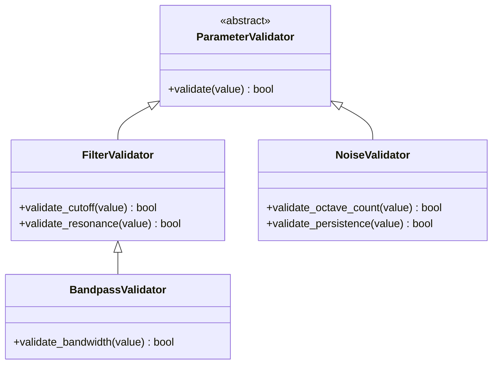

# Parameter System Architecture

## Overview

The parameter system manages audio processing parameters through a centralized core implementation. It provides a clean interface for both the audio engine and GUI components to access and modify parameters.

## New Directory Structure

### Core Components
- /core/parameters/base/
  - parameter.py (Base Parameter class)
  - parameter_type.py (Parameter type definitions)
  - parameter_interface.py (Core interfaces)

### Management Components
- /core/parameters/management/
  - registry.py (Parameter registry)
  - builder.py (Parameter builder)
  - factory.py (Parameter factory)

### Validation Components
- /core/parameters/validation/
  - validator.py (Base validation)
  - type_validators/ (Type-specific validation)
  - constraint_validators/ (Constraint validation)

### Notification Components
- /core/parameters/notification/
  - observer.py (Observer pattern)
  - notifier.py (Notification system)
  - event_types.py (Notification types)

### Metadata Components (consider move to gui)
- /core/parameters/metadata/
  - metadata.py (Base metadata)
  - control_binding.py (GUI control binding)
  - processor_binding.py (Processor-specific binding)

### Implementation Components
- /core/parameters/implementations/
  - basic_parameters/ (Simple parameter types)
  - complex_parameters/ (Advanced parameter types)
  - processor_parameters/ (Processor-specific parameters)

## Migration Plan

### Phase 1: Base Components Migration
1. Move base parameter classes to /base/
2. Update imports and references
3. Verify core functionality

### Phase 2: Management Components Migration
1. Move registry, builder, and factory to /management/
2. Update parameter registration flow
3. Test parameter creation and management

### Phase 3: Validation System Migration
1. Move validation logic to /validation/
2. Implement hierarchical validation structure
3. Update validation tests

### Phase 4: Notification System Migration
1. Move observer pattern implementation to /notification/
2. Update notification handling
3. Verify parameter change notifications

### Phase 5: Metadata System Migration
1. Move metadata handling to /metadata/
2. Update GUI bindings
3. Verify processor-specific bindings

### Phase 6: Implementation Migration
1. Move parameter implementations to /implementations/
2. Organize by parameter type
3. Update processor-specific parameters

## Design Patterns

### Observer Pattern
- ParameterSystem acts as Subject
- Components observe parameter changes
- Ensures synchronization between modules
- Decouples parameter management from processing

### Builder Pattern
- ParameterDefinitionBuilder for fluent parameter definition
- Improves readability and maintainability
- Reduces parameter definition boilerplate

## Validation Strategy

The system validates parameters at two levels:

### Parameter Definition Validation
- Ensures required fields are present
- Validates default values meet constraints
- Checks consistency in parameter metadata

### Parameter Value Validation
- Type checking (float, int, string, enum)
- Range validation (min/max)
- Enum validation (valid values)
- Custom validation rules

All validation is centralized in the core parameter system to ensure consistency across the application.

## Hierarchical Validation

The system implements validation at three levels to maximize code reuse while maintaining flexibility:

### Validation Levels
1. Base Validation:
   - Common parameter validation (e.g., range checking)
   - Shared across all processors

2. Processor Type Validation:
   - Filter-specific validation
   - Noise-specific validation
   - Shared within processor families

3. Individual Processor Validation:
   - Only when truly unique requirements exist
   - Inherits from processor type validation
